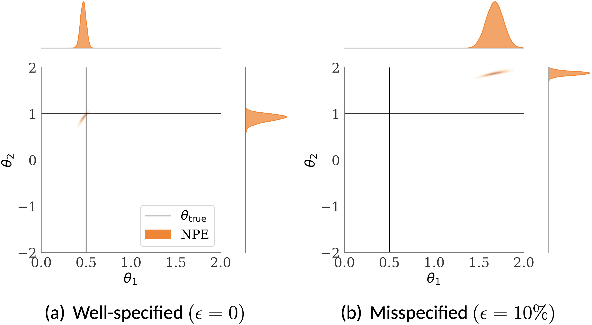

|  |
|:--:|
| *Figure 1: SBI is sensitive to model misspecification. Here, model is misspecified due to contamination.* |

Mechanistic simulations are used to model complex systems in research fields as diverse as genetics, epidemiology, geology and economics , for which explicit statistical models are challenging to express. In such simulator-based models, synthetic data are generated to represent the underlying real-world phenomena of interest based on our mechanistic understanding of the system. Unfortunately, standard statistical inference methods are poorly suited to simulator-based models, as their likelihood function---a quantity central to both frequentist and Bayesian inference---is typically intractable.
To address this issue, a host of **simulation-based inference** (SBI) methods have been developed that circumvent the need to evaluate the likelihood or its derivatives by relying on forward simulations from the model. SBI methods permit sampling from the approximate posterior by either comparing distances between simulated and observed datasets (or their respective summary statistics), or by training a conditional density estimator (typically neural networks) to approximate the simulator. SBI methods have led to significant advances in many scientific disciplines such as gravitational wave astronomy, particle physics, cognitive science, and ecology to name a few.

SBI methods implicitly assume that the simulator accurately represents the true data-generating process, and that generating large amounts of synthetic data from the simulator is straightforward. However, these assumptions are often not met in practice, as simulators of complicated real-world phenomena tend to be (i) **misspecified**, meaning that the data distribution does not lie in the parametric family of  distributions defined by the simulator, and (ii) **computationally costly to run**. 
Misspecification can occur when the simulator is not an accurate representation of the phenomenon being modelled; or when the data collection process induces outliers, broken independence assumption, missing data due to faulty sensors, or other stochastic modifications that are not accounted for in the simulator.
This can lead to unreliable and misleading inference outcomes as SBI methods rely on the simulations from the misspecified model. The resulting posteriors under misspecification can be wildly inaccurate and may even go outside the prior range.

 
|:--:|
 *Figure 2: We suggested sample efficient SBI method in multifidelity setting. ([paper](https://arxiv.org/abs/2506.06087))* |
